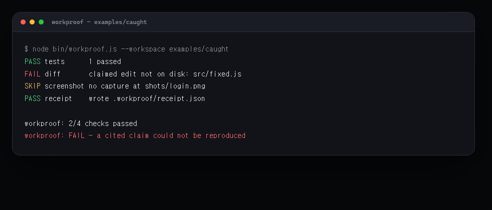
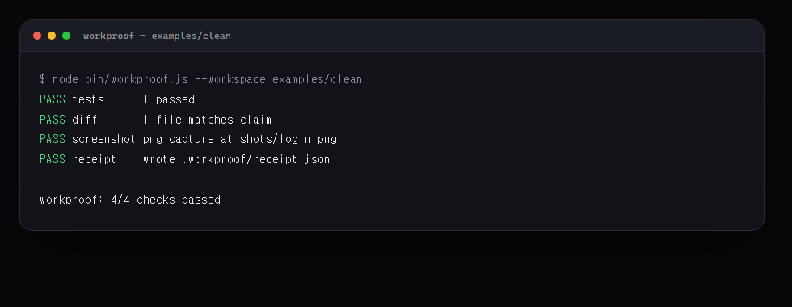
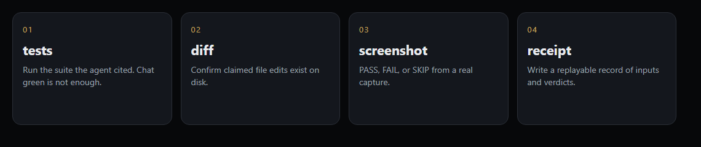

<p align="center">
  
</p>

<h1 align="center">workproof</h1>

<p align="center">
  <strong>After the agent finishes, prove the work actually happened.</strong>
</p>

<p align="center">
  Coding agents write code, run commands, and say they are done.<br />
  <code>workproof</code> is the one command that checks the claim.
</p>

<p align="center">
  <a href="https://github.com/kevin9327/workproof/actions/workflows/ci.yml"></a>
  
  
  
</p>

<p align="center">
  
</p>

If a cited claim cannot be reproduced, the process exits non-zero.

## The 30-second demo

An agent claimed it edited `src/fixed.js`. The file is not on disk.

```bash
git clone https://github.com/kevin9327/workproof
cd workproof
node bin/workproof.js --workspace examples/caught
```

<p align="center">
  
</p>

```text
PASS tests      1 passed
FAIL diff       claimed edit not on disk: src/fixed.js
SKIP screenshot no capture at shots/login.png
PASS receipt    wrote .workproof/receipt.json

workproof: 2/4 checks passed
workproof: FAIL — a cited claim could not be reproduced
```

When the claims are true:

```bash
node bin/workproof.js --workspace examples/clean
```

<p align="center">
  
</p>

## Four checks. One exit code.

<p align="center">
  
</p>

| Check | Question it answers |
| --- | --- |
| **tests** | Did the suite the agent cited actually run here, with the claimed result? If the runner cannot be invoked, this is FAIL. |
| **diff** | Do the files the agent said it changed exist on disk (and match optional `contains` / differ from `before`)? |
| **screenshot** | Is there a real image capture? Missing + required → FAIL. Missing + `required: false` → SKIP. |
| **receipt** | Was a replayable JSON record of the inputs and verdicts written and re-read? |

Chat green is not evidence. A receipt is.

## Install

No packages to install. Node 18+ and this repo:

```bash
git clone https://github.com/kevin9327/workproof
cd workproof
node bin/workproof.js --workspace examples/caught
```

From another project:

```bash
npx --yes github:kevin9327/workproof --workspace .
```

## Make an agent prove it

```bash
node bin/workproof.js init
```

That writes `.workproof/claim.json`. Point it at the test command and the files the agent said it changed, then run `workproof` again.

Drop `skills/workproof/SKILL.md` into Claude Code, Codex, Cursor, or any agent that reads skills. The rule is simple: **do not say the work is done until `workproof` exits 0.**

```json
{
  "tests": {
    "command": ["node", "--test", "demo.test.js"],
    "expect": "pass"
  },
  "diff": {
    "files": [
      { "path": "src/app.js", "op": "modify", "contains": "export function greet" }
    ]
  },
  "screenshot": {
    "path": "shots/login.png",
    "required": false
  }
}
```

## Run

```bash
node bin/workproof.js [workspace] [--claim <path>] [--receipt <path>]
node bin/workproof.js init [workspace]
node bin/workproof.js --json [workspace]
```

| Exit | Meaning |
| --- | --- |
| 0 | Every cited claim reproduced (SKIP is allowed) |
| 1 | A cited claim could not be reproduced |

`npm test` runs the same check functions the CLI uses.

## Why this exists

Agents are fast. They are also confident when they are wrong.

- Tests were “green” in the chat, not on disk
- A file was “updated” and the diff is empty
- A UI “works” and nobody opened a browser
- A bug is “fixed” and the failing case was never rerun

`workproof` turns those sentences into checks. If it cannot reproduce the result, it fails.

## License

MIT
